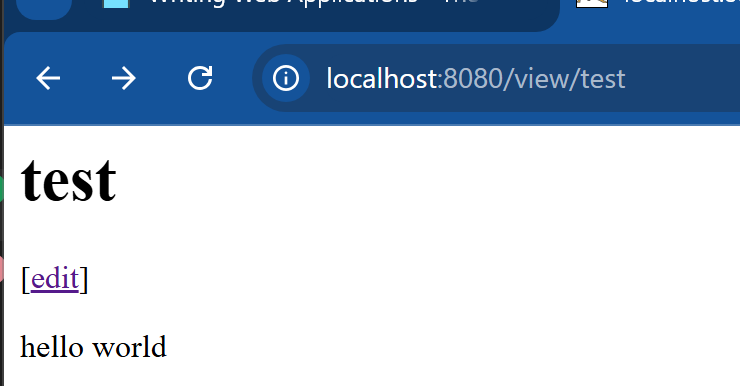

<div align=center>

# Framework Base Programming <br> Web-App Golang Assignment
Fayza Aqila Bachtiar - 5025221087

</div>

## data structures
A wiki consists of a series of interconnected pages, each of which has a title and a body (the page content). This will display a sample page within the terminal

```go
type Page struct {
	Title string
	Body  []byte
}

func (p *Page) save() error {
	filename := p.Title + ".txt"
	return os.WriteFile(filename, p.Body, 0600)
}

func loadPage(title string) (*Page, error) {
	filename := title + ".txt"
	body, err := os.ReadFile(filename)
	if err != nil {
		return nil, err
	}
	return &Page{Title: title, Body: body}, nil
}
```

By importing the std go library to the program and having it declares by a struct `page`, a method save `loadpage`, and a function `loadpage`. Main functions shall look as so:

```go
func main() {
	p1 := &Page{Title: "TestPage", Body: []byte("This is a sample Page.")}
	p1.save()
	p2, _ := loadPage("TestPage")
	fmt.Println(string(p2.Body))
}
```

to run the page we use commands:
```
go build wiki.go
./wiki
```
the display will look like so


## net/http 
### interlude
previously we have display the sample page, now we are able to apply it to the network page, using personal network route  

```go
func handler(w http.ResponseWriter, r *http.Request) {
	fmt.Fprintf(w, "Hi there, I love %s!", r.URL.Path[1:])
}

func main() {
	http.HandleFunc("/", handler)
	log.Fatal(http.ListenAndServe(":8080", nil))
}
```
adding a `handling` function to the file as well as `log` and `net/http` go library. to enable it we use the `apache tomcat` webserver to display the page. enter `http://localhost:8080/monkeys` to a browser.


### wiki app
as now we can add a new route and display by adding a new `handler` func as well as storing the data to a `test.txt`, u might as well simply add `hello world` in the .txt

changes in `wiki.go`
```go
func viewHandler(w http.ResponseWriter, r *http.Request) {
	title := r.URL.Path[len("/view/"):]
	p, _ := loadPage(title)
	fmt.Fprintf(w, "<h1>%s</h1><div>%s</div>", p.Title, p.Body)
}

func main() {
	... 
	http.HandleFunc("/view/", viewHandler)
    ...
}
```

the display shall be:


### edit/save 
a wiki page wont be perfect without any functionality to edit and save. to add these features are adding up several new functions, a render display, as well as the template of the view using `html`

### functions
```go
func editHandler(w http.ResponseWriter, r *http.Request) {
	title := r.URL.Path[len("/edit/"):]
	p, err := loadPage(title)
	if err != nil {
		p = &Page{Title: title}
	}
	renderTemplate(w, "edit", p)
}

func saveHandler(w http.ResponseWriter, r *http.Request) {
	title := r.URL.Path[len("/save/"):]
	body := r.FormValue("body")
	p := &Page{Title: title, Body: []byte(body)}
	p.save()
	http.Redirect(w, r, "/view/"+title, http.StatusFound)
}

...

func main() {
    ...
	http.HandleFunc("/edit/", editHandler)
	http.HandleFunc("/save/", saveHandler)
    ...
}
```

we will need new functions `edit` and `save` handler to make the functionality itself. then adding the page call in the main function. Either then new functions, the `viewHandler` func will also face changes

```go
func viewHandler(w http.ResponseWriter, r *http.Request) {
	title := r.URL.Path[len("/view/"):]
	p, err := loadPage(title)
	if err != nil {
		http.Redirect(w, r, "/edit/"+title, http.StatusFound)
		return
	}
	renderTemplate(w, "view", p)
}
```

### render func
to enable the ability of the system to display the edit and save, we will need a render to display the `html` template, there is where a render func comes in handy

```go
func renderTemplate(w http.ResponseWriter, tmpl string, p *Page) {
	t, _ := template.ParseFiles(tmpl + ".html")
	t.Execute(w, p)
}
```

### html
and lastly will be the html files itself. in this webApp, there will be 2 `.html` files, namely `edit.html` and `view.html`. both of them are templates for each of their purposes

- `edit.html`
```html
<h1>Editing {{.Title}}</h1>

<form action="/save/{{.Title}}" method="POST">
    <div><textarea name="body" rows="20" cols="80">{{printf "%s" .Body}}</textarea></div>
    <div><input type="submit" value="Save"></div>
</form>
```

- `view.html`
```html
<h1>{{.Title}}</h1>

<p>[<a href="/edit/{{.Title}}">edit</a>]</p>
<div>{{printf "%s" .Body}}</div>
```

the display shall look like this:

